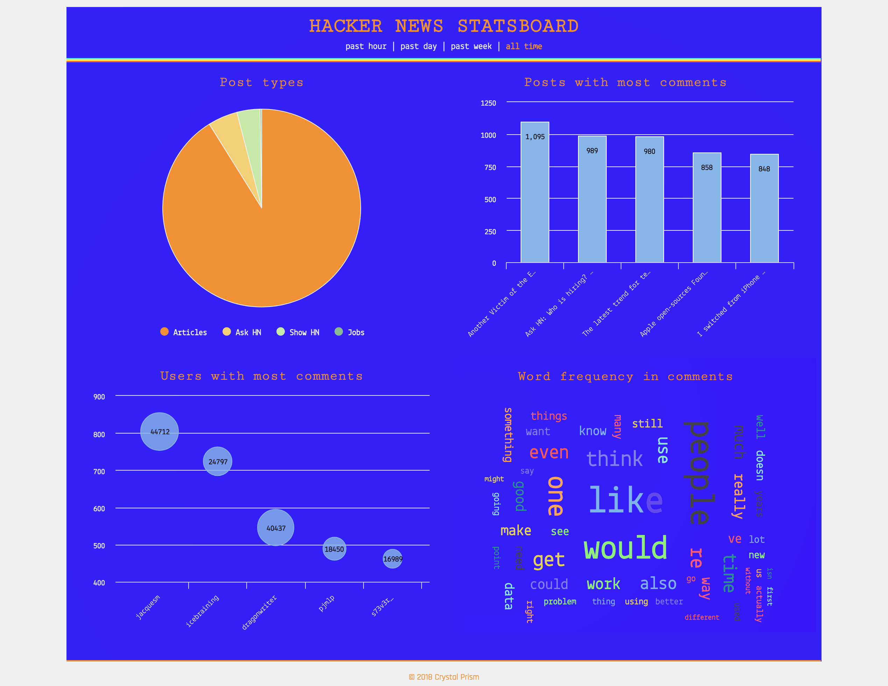

# Hacker News Stats

Hacker News Stats is a display of statistics from data scraped from Y Combinator's news site, [Hacker News](http://news.ycombinator.com/). I use [Requests](http://docs.python-requests.org/en/master/), [Beautiful Soup](https://www.crummy.com/software/BeautifulSoup/bs4/doc/), and [asyncio](https://docs.python.org/3/library/asyncio.html) libraries to acquire and parse the first three pages of posts from the main Hacker News feed asynchronously. I then store the data in an Amazon RDS instance of PostgreSQL and serve it through a series of API endpoints that return statistics based on time period (e.g., `/api/hacker_news/stats/hour/average_comment_count` returns the average comment count for posts in the past hour, `/api/hacker_news/stats/week/top_website` returns the most common websites that articles were posted from). The Stats page displays various [Highcharts](https://www.highcharts.com/) visualizations of the scraped data, including a pie chart that shows a breakdown of the different types of posts, a word cloud of the most common words used in post comments (excluding stop words), and a bubble chart of the top five users who posted the most comments (with each bubble's width reflecting their total words used). Buttons at the top of the Stats page allow the user to toggle between different time periods of data (e.g., past hour, past day, past week).

## Setup
1. Clone this repository locally or on your server.
2. Go to the project root directory, and install the required dependencies by running `npm install`.
3. Compile the required stylesheets and scripts by running `npm run build`.
